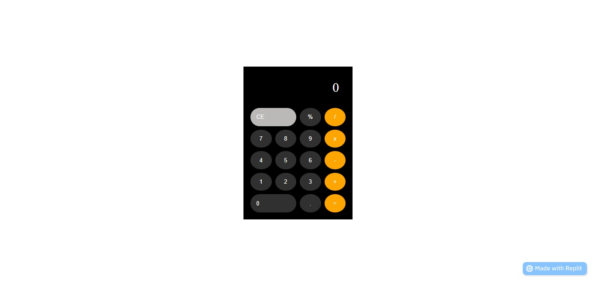

# New-Calculator

# Calculator app
# Altschool Frontend Engineering- Project

This is Altschool first capstone project in second semester for Frontend school of engineering.
## Table of contents

- [Overview](#overview)
  - [The challenge](#the-challenge)
  - [Screenshot](#screenshot)
  - [Links](#links)
  - [Built with](#built-with)
  - [Author](#author)

## Overview

### The challenge

Task requirements :

1. View the optimal layout for the app depending on their device's screen size
2. Create a calculator app using react
3. Implement mathematical operations(addition,multiplication, substraction,division e.t.c)

### Screenshot

### Links

- Solution URL:(https://github.com/ibimina/New-Calculator)
- Live Site URL: (https://New-Calculator.ibimina.repl.co)

### Built with

- React
- CSS custom properties
- Mobile-first workflow

## Author

- Ibimina Hart
- Linkedin -[ibimina hart](https://www.linkedin.com/in/ibimina-hart)
- Twitter -[@ibiminaaH](https://www.twitter.com/ibiminaaH)
- Frontend Mentor -[@ibimina](https://www.frontendmentor.io/profile/ibimina)

